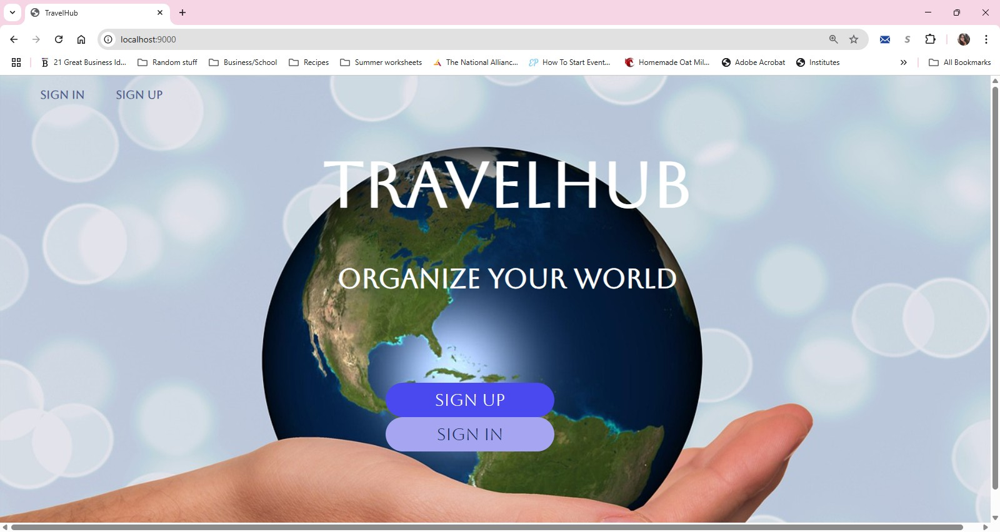
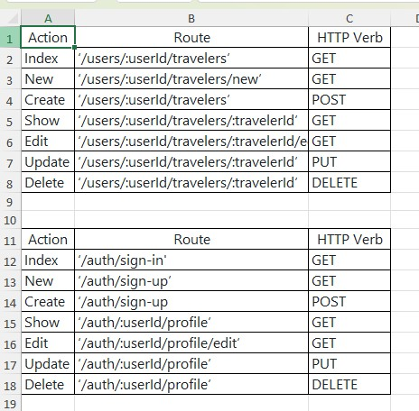

# TravelHub

## Screenshot:

## Description of app:
TravelHub is an app for travel agents to create a database to track their clients.  They can add, view, and enter each client's travel information.  They can also view and edit their own profile information.

**Planning materials:**

[Trello board](https://trello.com/invite/b/67e5d3e569de618da11451f2/ATTIa3ca7fb33ac2b130dc3aa23194599203E118F121/travelhub)  

[ERD](https://drive.google.com/file/d/136LBm782Fjbp2jc0hZLlDqc6lJaphOEq/view?usp=sharing)  

       <!DOCTYPE html>
        <html lang="en">
        <head>
            <meta charset="UTF-8">
            <meta name="viewport" content="width=device-width, initial-scale=1.0">
            <title>Edit <%= client.firstName %> <%= client.lastName %></title>
        </head>
        <body>
            <%- include('../partials/_navbar.ejs') %>
            <h1>Edit <%= client.firstName %> <%= client.lastName %></h1>
            <form action="/users/<%= user._id %>/clients/<%= client._id %>?_method=PUT" method="POST">
                
                <label for="lastName">Last Name:</label>
                <input type="text" name="lastName" id="lastName" value="<%= client.lastName %>">

                <label for="firstName">First Name:</label>
                <input type="text" name="firstName" id="firstName" value="<%= client.firstName %>">

                <label for="phoneNumber">Phone Number:</label>
                <input type="text" name="phoneNumber.number" id="phoneNumber.number" value="<%= client.phoneNumber.number %>">

                <label for="phoneCategory">Type:</label>
                <input type="radio" id="office" name="phoneNumber.category" value="office" <%= client.phoneNumber.category === "office" ? "checked" : '' %>>
                <label for="office">Office</label>
                <input type="radio" id="mobile" name="phoneNumber.category" value="mobile" <%= client.phoneNumber.category === "mobile" ? "checked" : '' %>>
                <label for="mobile">Mobile</label>
                <label for="phonePreferred">Preferred Contact</label>
                <input type="checkbox" name="phonePreferred" id="phonePreferred" <% if (client.phonePreferred) { %> checked <% } %> >

                <label for="email">Email:</label>
                <input type="text" name="email" id="email" value="<%= client.email %>">
                <label for="emailPreferred">Preferred Contact</label>
                <input type="checkbox" name="emailPreferred" id="emailPreferred" <% if (client.emailPreferred) { %> checked <% } %> >

                <label for="departDate">Depart Date:</label>
                <input type="date" name="departDate" id="departDate" value="<%= client.departDate ? new Date(client.departDate).toISOString().split('T')[0] : '' %>">

                <label for="returnDate">Return Date:</label>
                <input type="date" name="returnDate" id="returnDate" value="<%= client.returnDate ? new Date(client.returnDate).toISOString().split('T')[0] : '' %>">

                <label for="destination">Destination:</label>
                <input type="text" name="destination" id="destination" value="<%= client.destination %>">

                <label for="hotel">Hotel:</label>
                <input type="text" name="hotel" id="hotel" value="<%= client.hotel %>">

                <label for="airline">Airline:</label>
                <input type="text" name="airline" id="airline" value="<%= client.airline %>">

                <label for="carRentalRequired">Require Car Rental:</label>
                <select id="carRentalRequired" name="carRentalRequired">
                    <option value="yes"
                        <%= client.carRentalRequired === 'yes' ? 'selected' : '' %>
                        >Yes</option>
                    <option value="no"
                        <%= client.carRentalRequired === 'no' ? 'selected' : '' %>
                        >No</option>
                    <option value="maybe"
                        <%= client.carRentalRequired === 'maybe' ? 'selected' : '' %>
                        >Maybe</option>
                </select>

                <label for="status">Status:</label>
                <select id="status" name="status">
                    <option value="tentative"
                        <%= client.status === 'tentative' ? 'selected' : '' %>
                        >Tentative</option>
                    <option value="paymentPending"
                        <%= client.status === 'paymentPending' ? 'selected' : '' %>
                        >Payment Pending</option>
                    <option value="booked"
                        <%= client.status === 'booked' ? 'selected' : '' %>
                        >Booked</option>
                </select>

                <label for="notes">Notes:</label>
                <textarea name="notes" id="notes"><%= client.notes %></textarea>

                <button type="submit">Update Client</button>
            </form>
        </body>
        </html> 

## Attributions:
Google Fonts:
[Aboreto](https://fonts.googleapis.com/css2?family=Aboreto&display=swap")

## Technologies used:
Javascript  
HTML  
CSS  
Express.js  
MongoDB  
npm  
Express-session  
EJS  
Method-Override
Mongoose  
dotenv  
bcrypt  

## Stretch goals
As a user, I want to add multiple travelers to the same trip.

As user, I want to be able to sort by depart date or client name as needed.

As a user, I want to be able to easily search by client info (first name, last name, phone number, email, destination, depart date, arrival date, etc...)  

As a user, I would like an option to reset my password if I have forgotten it.
                
